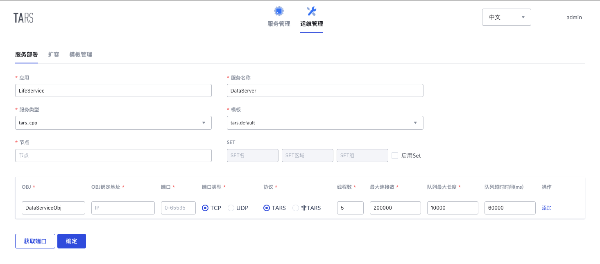

# DataServer
案例C++后端，用于直接操作数据库，对其他服务提供数据操作接口

服务接口可查看[接口文档](docs/RPC.md)
## 项目结构
```sh
.
├── Config.h                # 配置文件
├── DataServer.cpp          # 服务实现
├── DataServer.h
├── DataServiceImp.cpp      # 接口实现
├── DataServiceImp.h        # 接口定义
├── DataService.tars        # tars协议文件
├── DbHandle.cpp            # DbHandle实现
├── DbHandle.h              # 数据模型
├── makefile                # 项目构建makefile
├── MysqlHandler.cpp        # MysqlHandler实现
├── MysqlHandler.h          # Mysql操作
├── README.md
├── test
│   └── test_util.cpp       # 工具类测试
├── util.cpp                # util实现
└── util.h                  # Mysql语句组装工具
```

## 开发环境
* `gcc` >= `4.8.2`
* `bison` >= `2.5`
* `flex` >= `2.5`
* `cmake` >= `2.8.8`
* `mysql` >= `5.6`
* `TarsCpp`开发框架, 安装方法参考[TarsCpp/README.md](https://github.com/TarsCloud/TarsCpp/blob/master/README.zh.md), 开发框架的使用可以参考[快速开始](https://github.com/TarsCloud/TarsCpp/blob/master/docs/tars_cpp_quickstart.md)和[开发指南](https://github.com/TarsCloud/TarsCpp/blob/master/docs/tars_cpp_user_guide.md)

## 构建方式
将项目clone到任意目录下，修改`Config.h`中的数据库配置为自己的数据库配置，然后使用下列命令即可编译项目，生成发布包

```sh
make
make tar
```

## 服务部署

### 部署信息
在Tars平台->运维管理->服务部署中，按如下信息部署服务，其中节点填写自己需要部署服务的节点

* 服务基本信息：
    * 应用名称：LifeService
    * 服务名称：DataServer
    * 服务类型：tars_cpp
    * 模板名称：tars.default
* Obj部署信息：
    * OBJ名称：DataServiceObj
    * 协议类型：TARS
    * 端口：自动生成



### 服务发布
在**Tars平台->服务管理->LifeService->DataServer->发布管理**中，
* 选中刚刚部署的节点，点击发布选中节点
* 上传发布包，选中构建项目生成的发布包上传
* 在发布版本中便可以找到刚刚上传的发布包并选择
* 点击发布即可完成发布

同时需要在**服务配置**中添加文件`DataServer.conf`，其中配置如下，没有添加会直接使用`Config.h`中填写的值

```xml
<LifeService>
    usPortConfig=3306
    strDbHostConfig=xxx.xxx.xxx.xxx
    strUserNameConfig=yourusername
    strPassWordConfig=yourpassword
    strDbNameConfig=yourdbname
    maxMatch=2000
</LifeService>
```
