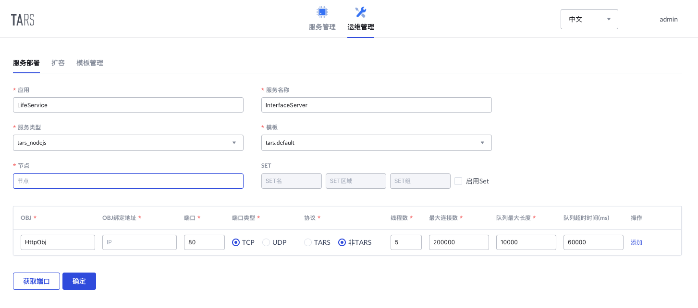

# InterfaceServer

大学生活服务平台-接入层，为小程序提供服务接入。
服务接口可查看[接口文档](docs/API.md)。

## 项目结构
```sh
InterfaceServer
├── app.js                       # 入口文件
├── README.md
├── API.md                       # 接口文档
├── config                       # 配置模块目录
│   └── appConf.js
├── node_modules                 # npm包安装目录
├── package.json
├── package-lock.json
├── proxy                        # tars文件及其生成代理文件存放目录
│   ├── DataService.tars
│   ├── ServerStatus.tars
│   ├── UserInfoService.tars
│   ├── ClubActivityManager.tars
│   └── MessageWall.tars
├── router                       # 路由模块目录
│   ├── index.js
│   └── routerConf.js            # 路由配置
├── servers                      # 各服务接口的实现文件目录
│   ├── UserInfoServer.js
│   ├── ClubActivityServer.js
│   ├── MessageWallServer.js
│   ├── UserInfoServer.js
│   └── WeixinAPI.js
└── tools                        # 工具目录
    └── util.js
```

## 开发环境
- `Node.js` >= 0.10
- `tars-deploy`, TarsNode.js项目打包工具，安装和用法参考[tarsnode/deploy](https://github.com/tars-node/deploy/tree/master)

## 构建方式

将项目clone到任意目录下，修改`config/appConf.js`配置模块中的服务器证书和密钥路径为自己的证书和密钥路。

进入项目下proxy目录，将tars协议文件转换为对应的js文件
```sh
cd proxy
/usr/local/tars/cpp/tools/tars2node DataService.tars              # 将tars协议中的数据类型转化为js对应数据类型供编解码使用
/usr/local/tars/cpp/tools/tars2node ServerStatus.tars
/usr/local/tars/cpp/tools/tars2node UserInfoService.tars --client # 生成客户端的调用类代码
/usr/local/tars/cpp/tools/tars2node ClubActivityManager.tars --client
/usr/local/tars/cpp/tools/tars2node MessageWall.tars --client
cd -
```

运行命令
```sh
npm install
```
安装项目所需包，再使用`tars-deploy`打包项目为发布包
```
tars-deploy InterfaceServer
```

## 服务部署

### 部署信息
在Tars平台->运维管理->服务部署中，按如下信息部署服务，其中节点填写自己需要部署服务的节点

* 服务基本信息：
    * 应用名称：LifeService
    * 服务名称：InterfaceServer
    * 服务类型：tars_nodejs
    * 模板名称：tars.default
* Obj部署信息：
    * OBJ名称：HttpObj
    * 协议类型：非TARS
    * 端口：80 （小程序要求请求端口为80端口）



### 服务发布
在Tars平台->服务管理->LifeService->InterfaceServer->发布管理中，
* 选中刚刚部署的节点，点击发布选中节点
* 上传发布包，选中构建项目生成的发布包上传
* 在发布版本中便可以找到刚刚上传的发布包并选择
* 点击发布即可完成发布